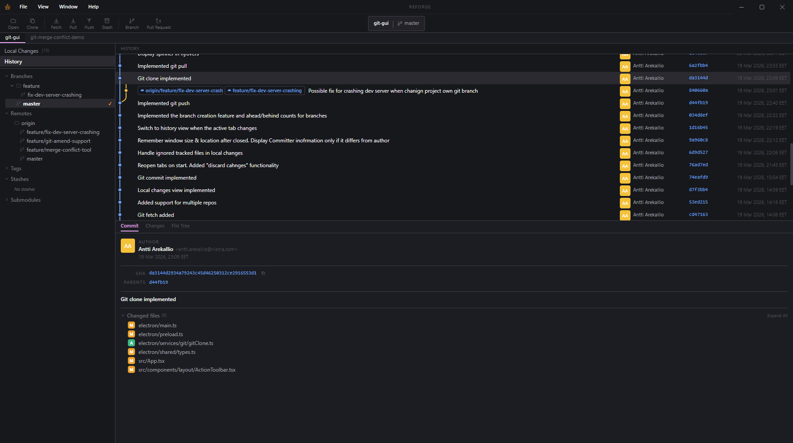

  

# Reforge

**Cross-platform desktop Git GUI for Windows, macOS, and Linux**  
with **intuitive merge conflict resolving** and a **minimalistic, easy-to-use UI**.

  
  
  

## Overview

Reforge is a desktop Git client built for developers who want a clean, focused workflow without losing access to the power of Git.

It aims to make everyday version control tasks feel fast, visual, and approachable — from browsing history and managing branches to handling complex merge conflicts with confidence.

## Why Reforge?

- **Cross-platform** — designed for Windows, macOS, and Linux
- **Minimalistic UI** — clean interface with low visual clutter
- **Easy to use** — approachable for daily workflows without hiding Git concepts
- **Built for real work** — especially focused on making merge conflict resolution more intuitive

## Core Focus

Reforge is designed around a few core ideas:

- Make Git history easier to understand visually
- Keep common workflows simple and fast
- Reduce friction around merges and conflict resolution
- Provide a polished desktop experience

## Planned Features

- **Interactive Rebase**
- **File History View**
- **Revert**
- **Submodules**
- **And probably much more**

## Status

Reforge is currently in active development.

The goal is to create a fast, modern Git GUI with a compact desktop-first interface and a smooth workflow for both everyday Git tasks and more advanced repository operations.

## Vision

Reforge should feel like a tool you can keep open all day:

- lightweight in workflow
- powerful when needed
- visually calm
- clear during complicated Git operations

## Contributing

Contributions, ideas, and feedback are welcome.

If you want to help shape Reforge, feel free to open an issue, start a discussion, or submit a pull request.

## License

Reforge is released under the MIT License.  
Copyright (c) 2026 Antti Arekallio.  
See [LICENSE](LICENSE) for the full text.